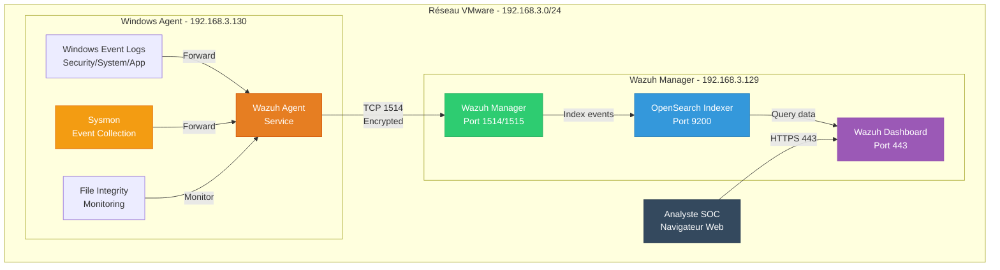

# 🏗️ Architecture du Wazuh SOC Lab

Ce document décrit l'architecture technique du lab SIEM Wazuh.

---

## 📊 Schéma d'architecture



---

## 🖥️ Composants détaillés

### 1. Wazuh Manager (All-in-One Deployment)

**Serveur : Ubuntu 22.04 LTS**
- **IP :** 192.168.3.129
- **RAM :** 4 GB
- **Disque :** 60 GB (extensible via LVM)
- **vCPU :** 2 cores

**Services hébergés :**

#### A. Wazuh Manager
- **Fonction :** Collecte, corrélation et analyse des événements
- **Port :** 1514 (TCP) - Communication agents
- **Port :** 1515 (TCP) - Enrollment agents
- **Logs :** `/var/ossec/logs/`
- **Règles :** `/var/ossec/ruleset/rules/`
- **Decoders :** `/var/ossec/ruleset/decoders/`

**Fonctionnalités :**
- Décodage des logs normalisés (JSON)
- Corrélation d'événements multi-sources
- Détection basée sur règles (14 niveaux de sévérité)
- Mapping MITRE ATT&CK automatique
- Active Response (optionnel)

#### B. OpenSearch Indexer
- **Fonction :** Stockage et indexation des événements
- **Port :** 9200 (HTTPS) - API REST
- **Port :** 9300 (TCP) - Communication inter-nœuds
- **Données :** `/var/lib/wazuh-indexer/`
- **Index pattern :** `wazuh-alerts-4.x-*`

**Configuration :**
- Rétention : 14 jours (ISM policy)
- Shards : 1 primary, 0 replicas (environnement mono-nœud)
- Taille actuelle : ~10 MB pour 3000 événements

#### C. Wazuh Dashboard
- **Fonction :** Interface web de visualisation
- **Port :** 443 (HTTPS)
- **Framework :** OpenSearch Dashboards (fork Kibana)
- **URL :** https://192.168.3.129

**Fonctionnalités :**
- Visualisation temps réel des alertes
- Tableaux de bord MITRE ATT&CK
- Compliance (PCI-DSS, GDPR, NIST)
- Gestion des agents
- Requêtes personnalisées (DQL)

---

### 2. Windows Agent (Endpoint Monitoring)

**Machine : Windows 10 Pro**
- **Hostname :** WIN-AGENT-01
- **IP :** 192.168.3.130
- **RAM :** 4 GB
- **Disque :** 40 GB
- **vCPU :** 2 cores
- **Rôle simulé :** Poste de travail administrateur IT

**Composants de sécurité :**

#### A. Wazuh Agent
- **Version :** 4.7.x
- **ID :** 001
- **Service :** `WazuhSvc`
- **Configuration :** `C:\Program Files (x86)\ossec-agent\ossec.conf`
- **Logs locaux :** `C:\Program Files (x86)\ossec-agent\ossec.log`

**Méthode de collecte :**
- Filtrage par défaut : `logall=no` (seuls les événements matchant une règle sont envoyés)
- Communication : TCP chiffré (TLS) sur port 1514
- Fréquence : Temps réel (polling Event Logs toutes les secondes)

#### B. Sysmon (System Monitor)
- **Version :** Dernière via Sysinternals
- **Configuration :** SwiftOnSecurity (open-source)
- **Log :** `Microsoft-Windows-Sysmon/Operational`

**Événements collectés (exemples) :**
- Event ID 1 : Process Creation
- Event ID 3 : Network Connection
- Event ID 7 : Image Loaded (DLL)
- Event ID 11 : File Created
- Event ID 13 : Registry Value Set

**Avantages :**
- Visibilité granulaire sur les processus
- Détection de techniques d'évasion
- Contexte enrichi (hashes, command lines, parent processes)

#### C. Windows Event Logs

**Sources collectées :**

| Log Source | Type | Événements clés |
|------------|------|-----------------|
| **Security** | eventchannel | 4624 (Logon success), 4625 (Logon failure), 4688 (Process creation) |
| **System** | eventchannel | 7045 (Service installed), 1074 (Shutdown initiated) |
| **Application** | eventchannel | Erreurs applicatives, crashes |

**Filtrage appliqué :**
- EventID 5145 exclu (partages réseau - trop verbeux)
- EventID 4662 exclu (accès objets AD - trop verbeux)
- EventID 4688 exclu si déjà collecté par Sysmon Event ID 1

#### D. File Integrity Monitoring (FIM)

**Répertoires surveillés :**
- `C:\Windows\System32` (binaires système critiques)
- `C:\Program Files` (applications installées)
- `C:\Program Files (x86)` (applications 32-bit)

**Attributs surveillés :**
- Modification de fichier (hash SHA256)
- Création/suppression
- Changements de permissions

**Fréquence de scan :** Toutes les 12 heures (43200 secondes)

#### E. Security Configuration Assessment (SCA)

**Benchmarks appliqués :**
- CIS Microsoft Windows 10 Enterprise Benchmark
- CIS Microsoft Windows 10 Standalone Benchmark

**Vérifications :**
- Politiques de mots de passe
- Configuration du pare-feu
- Services désactivés
- Permissions de fichiers critiques

**Fréquence de scan :** Toutes les 12 heures

---

## 🔄 Flux de données

### Étape 1 : Collecte (Agent Windows)
```
Windows Events → Wazuh Agent (local buffer)
Sysmon Events → Wazuh Agent
FIM Changes → Wazuh Agent
SCA Results → Wazuh Agent
```

### Étape 2 : Transmission
```
Wazuh Agent → [TCP 1514 chiffré] → Wazuh Manager
Format : JSON enrichi
Compression : Oui
```

### Étape 3 : Analyse (Manager)
```
Raw Event → Decoder (normalisation)
          → Rules Engine (corrélation)
          → MITRE ATT&CK Mapping
          → Severity Assignment (0-15)
          → Enrichment (GeoIP, threat intel)
```

### Étape 4 : Indexation
```
Analyzed Event → OpenSearch Indexer
              → Index: wazuh-alerts-4.x-YYYY.MM.DD
              → Stockage JSON compressé
```

### Étape 5 : Visualisation
```
User Query (Dashboard) → OpenSearch Query (DQL)
                       → Results Rendering
                       → Charts/Tables Display
```

---

## 🔐 Sécurité de l'architecture

### Communication chiffrée
- **Agent ↔ Manager :** TLS 1.2+ (certificats auto-signés)
- **Dashboard ↔ Indexer :** HTTPS (certificats auto-signés)
- **User ↔ Dashboard :** HTTPS

### Authentification
- **Dashboard :** Utilisateur `admin` + mot de passe fort généré
- **Agents :** Clé pré-partagée unique par agent (dans `client.keys`)

### Isolation réseau
- Réseau privé VMware (192.168.3.0/24)
- Pas d'exposition Internet directe
- Accès Dashboard depuis l'hôte VMware uniquement

---

## 📈 Dimensionnement et performance

### Volumes de données actuels

**Événements par jour :**
- Windows Security : ~200-300 événements
- Sysmon : ~100-200 événements
- System/Application : ~50-100 événements
- FIM : ~10-20 événements (selon activité)
- **Total :** ~500-700 événements/jour

**Stockage :**
- Taille moyenne par événement : ~3 KB
- Stockage quotidien : ~1.5-2 MB/jour
- Stockage 14 jours : ~20-30 MB

**Ressources utilisées :**
- CPU Manager : 5-10% (idle), 30-50% (during scan)
- RAM Manager : 2.5 GB / 4 GB
- Disque Manager : 36 GB / 57 GB (63%)

### Scalabilité

**Capacité actuelle (mono-agent) :**
- Agents supportés : 1 agent actif
- EPS max théorique : ~500 EPS
- Latence moyenne : < 1 seconde

**Pour scale-up (10+ agents) :**
- Augmenter RAM Manager : 8-16 GB
- Augmenter Indexer RAM : 4-8 GB
- Configurer Indexer shards/replicas
- Ajouter rotation logs agressive

---

## 🛠️ Points de maintenance

### Fichiers de configuration critiques

**Manager :**
```
/var/ossec/etc/ossec.conf           # Configuration principale
/var/ossec/etc/client.keys          # Clés des agents
/var/ossec/ruleset/rules/           # Règles de détection
/var/ossec/ruleset/decoders/        # Décodeurs de logs
```

**Agent Windows :**
```
C:\Program Files (x86)\ossec-agent\ossec.conf          # Configuration agent
C:\Program Files (x86)\ossec-agent\client.keys         # Clé d'authentification
C:\Sysmon\sysmonconfig.xml                             # Config Sysmon
```

### Logs à surveiller

**Manager :**
```
/var/ossec/logs/ossec.log           # Logs généraux manager
/var/ossec/logs/alerts/alerts.log   # Toutes les alertes
/var/log/wazuh-indexer/wazuh-cluster.log  # Logs indexer
```

**Agent :**
```
C:\Program Files (x86)\ossec-agent\ossec.log  # Logs agent
```

---

## 🔄 Plan de reprise après incident

### Sauvegarde recommandée

**Manager (à sauvegarder régulièrement) :**
- `/var/ossec/etc/` (configurations)
- `/var/ossec/ruleset/` (règles personnalisées)
- Dashboard : Export des visualisations/dashboards

**Agent (fichiers à conserver) :**
- `ossec.conf` (configuration)
- `client.keys` (clé d'authentification)

### Restauration rapide

**Manager down :**
1. Réinstaller Ubuntu + Wazuh All-in-One
2. Restaurer `/var/ossec/etc/ossec.conf`
3. Restaurer `/var/ossec/etc/client.keys`
4. Redémarrer les services

**Agent down :**
1. Réinstaller agent Wazuh
2. Restaurer `ossec.conf` et `client.keys`
3. Redémarrer service agent

**Temps de restauration estimé :** 30-60 minutes

---

*Version Wazuh : 4.7.x*
